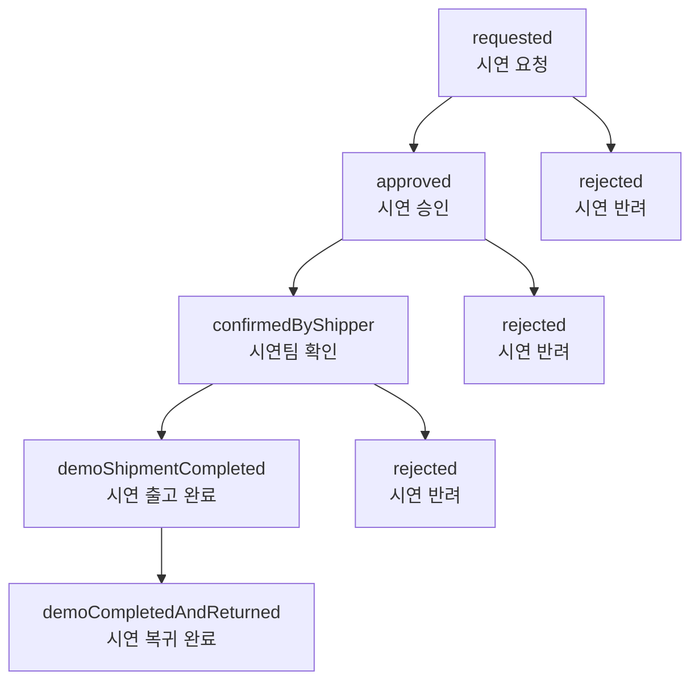

# KARS 시연 시스템 비즈니스 로직

> **[2025-07-05 v1.5.1] 주요 업데이트**
>
> - 시연 신청 폼 UI/UX 개선 (창고 선택 드롭다운 단일화, 자동 선택 로직 개선)
> - 시연 아이템 선택: 창고별 실제 재고 아이템 목록 기반 동적 선택 UI 제공
> - 체크박스 및 수량 조절 로직 개선 (teamItem 기준 일원화, 전체 선택/해제 동작 개선)
> - 불필요한 정보(창고 주소 등) 제거, 드롭다운만 노출
> - 실제 재고 연동: 창고 변경 시 해당 창고의 실재고 아이템만 선택 가능
> - 문서화: CHANGELOG, 업데이트 내역, 비즈니스 로직 최신화

---

## 1. 개요

KARS 시연 시스템은 제품 시연을 위한 전용 관리 시스템입니다. 일반 주문과 유사하지만 시연 목적에 최적화된 별도의 워크플로우를 제공합니다.

### 1.1 주요 특징

- **시연 전용 프로세스**: 일반 주문과 구분된 시연 전용 상태 관리
- **재고 연동**: 시연 출고 시 자동 재고 차감 및 복귀 시 재고 복구
- **권한 기반 접근**: 사용자 권한에 따른 차별화된 기능 제공
- **팀 단위 관리**: 팀별 데모 데이터 격리 및 관리

## 2. 데모 상태 관리

### 2.1 데모 상태 흐름



### 2.2 상태별 설명

| 상태                       | 의미                    | 다음 가능 상태                      | 권한             |
| -------------------------- | ----------------------- | ----------------------------------- | ---------------- |
| `requested`                | 시연 요청 (초기 상태)   | `approved`, `rejected`              | Moderator, Admin |
| `approved`                 | 시연 승인 (1차승인권자) | `confirmedByShipper`, `rejected`    | Admin            |
| `rejected`                 | 시연 반려               | -                                   | 최종 상태        |
| `confirmedByShipper`       | 시연팀 확인 완료        | `demoShipmentCompleted`, `rejected` | Admin            |
| `demoShipmentCompleted`    | 시연 출고 완료          | `demoCompletedAndReturned`          | Admin            |
| `demoCompletedAndReturned` | 시연 복귀 완료          | -                                   | 최종 상태        |

### 2.3 상태 변경 규칙

#### 권한별 상태 변경 가능 범위

- **Moderator**: 초기 승인 단계만 담당
  - `requested` → `approved`/`rejected`
- **Admin**: 전체 시연 프로세스 관리
  - `approved` → `confirmedByShipper`/`rejected`
  - `confirmedByShipper` → `demoShipmentCompleted`/`rejected`
  - `demoShipmentCompleted` → `demoCompletedAndReturned`

## 3. 권한 시스템 적용

### 3.1 권한별 접근 제어

#### Admin (관리자)

- ✅ 모든 데모 조회/생성/수정
- ✅ 모든 상태 변경 권한
- ✅ 데모 삭제 권한
- ✅ 시연 관련 재고 관리

#### Moderator (1차승인권자)

- ✅ 데모 조회 (읽기 전용)
- ✅ 초기 승인 단계 관리 (`requested` → `approved`/`rejected`)
- ❌ 시연 진행 단계 관리 불가
- ❌ 직접적인 재고 수정 불가

#### User (일반 사용자)

- ✅ 자신이 요청한 데모 조회
- ✅ 데모 요청 생성
- ❌ 상태 변경 불가
- ❌ 타인의 데모 조회 불가

#### Supplier (외부업체)

- ✅ 자신과 관련된 데모 조회
- ❌ 데모 생성 불가
- ❌ 상태 변경 불가

### 3.2 데이터 접근 제어

```typescript
// 팀 기반 데이터 격리
const { data: demosResponse } = useDemosByTeam(selectedTeamId);

// 사용자 권한 확인
const canManageDemo =
  user.accessLevel === "admin" || user.accessLevel === "moderator";
const canApproveDemo =
  user.accessLevel === "admin" || user.accessLevel === "moderator";
const canManageShipment = user.accessLevel === "admin";
```

## 4. 비즈니스 로직 구현

### 4.1 데모 조회 로직

#### 팀별 데모 목록 조회

```typescript
// src/hooks/(useDemo)/useDemoQueries.ts
export const useDemosByTeam = (teamId: number) => {
  return useQuery({
    queryKey: ["demos", "team", teamId],
    queryFn: () => getDemoByTeamId(teamId),
    enabled: !!teamId,
    staleTime: 30 * 60 * 1000, // 30분 캐싱
  });
};
```

**특징:**

- 팀 ID 기반 데이터 격리
- 30분 캐싱으로 성능 최적화
- 자동 refetch 방지로 네트워크 트래픽 최소화

#### 단일 데모 조회

```typescript
export const useSingleDemo = (demoId: number) => {
  return useQuery({
    queryKey: ["demo", demoId],
    queryFn: () => getDemoById(demoId),
    enabled: !!demoId,
    staleTime: 30 * 60 * 1000,
  });
};
```

### 4.2 데모 생성 로직

```typescript
// src/hooks/(useDemo)/useDemoMutations.ts
export const useCreateDemo = () => {
  const queryClient = useQueryClient();

  return useMutation<ApiResponse, Error, void>({
    mutationFn: () => createDemo(),
    onSuccess: () => {
      queryClient.invalidateQueries({ queryKey: ["demos"] });
    },
  });
};
```

**생성 프로세스:**

1. 데모 생성 요청 (`createDemo()`)
2. 초기 상태 `requested`로 설정
3. 관련 캐시 무효화 (`["demos"]`)
4. 자동 목록 새로고침

### 4.3 데모 상태 변경 로직

```typescript
export const useUpdateDemoStatus = () => {
  const queryClient = useQueryClient();

  return useMutation({
    mutationFn: ({ id, data }: { id: number; data: UpdateDemoStatusDto }) =>
      updateDemoStatusById(id, { status: data.status }),
    onSuccess: async (response, variables) => {
      if (response.success) {
        // 기본 캐시 무효화
        await queryClient.invalidateQueries({ queryKey: ["demos"] });
        await queryClient.invalidateQueries({
          queryKey: ["demo", variables.id],
        });

        // 시연 출고 완료 시 재고 연동
        if (variables.data.status === DemoStatus.demoShipmentCompleted) {
          await queryClient.invalidateQueries({ queryKey: ["inventory"] });
          await queryClient.invalidateQueries({ queryKey: ["shipments"] });
          await queryClient.invalidateQueries({ queryKey: ["warehouseItems"] });
        }
      }
    },
  });
};
```

**상태 변경 프로세스:**

1. 권한 검증 (클라이언트 + 서버)
2. 상태 변경 요청
3. 성공 시 관련 캐시 무효화
4. 특정 상태 시 추가 데이터 갱신

## 5. 재고 연동 로직

### 5.1 시연 출고 시 재고 처리

```typescript
// 시연 출고 완료 상태 변경 시
if (variables.data.status === DemoStatus.demoShipmentCompleted) {
  // 1. 재고 정보 최신화
  await queryClient.invalidateQueries({ queryKey: ["inventory"] });

  // 2. 입/출고 정보 최신화
  await queryClient.invalidateQueries({ queryKey: ["shipments"] });

  // 3. 창고 아이템 정보 최신화
  await queryClient.invalidateQueries({ queryKey: ["warehouseItems"] });
}
```

### 5.2 재고 연동 규칙

| 데모 상태                  | 재고 영향      | 처리 방식 |
| -------------------------- | -------------- | --------- |
| `demoShipmentCompleted`    | 재고 차감      | 자동 처리 |
| `demoCompletedAndReturned` | 재고 복구      | 자동 처리 |
| 기타 상태                  | 재고 영향 없음 | -         |

## 6. 캐싱 전략

### 6.1 캐시 키 구조

```typescript
// 캐시 키 명명 규칙
["demos", "team", teamId][("demo", demoId)]["demos"]; // 팀별 데모 목록 // 단일 데모 // 모든 데모 (무효화용)
```

### 6.2 캐시 무효화 전략

```typescript
// 데모 생성 시
queryClient.invalidateQueries({ queryKey: ["demos"] });

// 데모 상태 변경 시
queryClient.invalidateQueries({ queryKey: ["demos"] });
queryClient.invalidateQueries({ queryKey: ["demo", demoId] });

// 재고 연동 시 (시연 출고 완료)
queryClient.invalidateQueries({ queryKey: ["inventory"] });
queryClient.invalidateQueries({ queryKey: ["shipments"] });
queryClient.invalidateQueries({ queryKey: ["warehouseItems"] });
```

### 6.3 캐시 설정

- **staleTime**: 30분 (30 _ 60 _ 1000ms)
- **gcTime**: 30분 (30 _ 60 _ 1000ms)
- **refetchOnWindowFocus**: false
- **refetchOnMount**: false
- **refetchOnReconnect**: false

## 7. 에러 처리

### 7.1 API 에러 처리

```typescript
// demo-api.ts 예시
export const getDemoByTeamId = async (teamId: number) => {
  try {
    const response = await api.get(`/order/demo/team/${teamId}`);
    return response.data;
  } catch {
    return {
      success: false,
      message: "주문 데모 목록 조회에 실패했습니다.",
    };
  }
};
```

### 7.2 Hook 레벨 에러 처리

```typescript
// 사용 예시
const { data, error, isLoading } = useDemosByTeam(teamId);

if (error) {
  console.error("데모 조회 실패:", error);
  // 에러 UI 표시
}
```

## 8. 사용 예시

### 8.1 기본 사용법

```typescript
import { useDemo } from "@/hooks/useDemo";
import { authStore } from "@/store/authStore";
import { DemoStatus } from "@/types/demo/demo";

const DemoComponent = () => {
  const { useDemosByTeam, useCreateDemo, useUpdateDemoStatus } = useDemo();
  const selectedTeamId = authStore((state) => state.selectedTeam?.id);

  // 데모 목록 조회
  const {
    data: demosResponse,
    isLoading,
    error,
  } = useDemosByTeam(selectedTeamId || 0);

  // 데모 생성
  const createDemoMutation = useCreateDemo();

  // 데모 상태 변경
  const updateStatusMutation = useUpdateDemoStatus();

  const handleCreateDemo = async () => {
    try {
      await createDemoMutation.mutateAsync();
      toast.success("데모가 생성되었습니다.");
    } catch (error) {
      toast.error("데모 생성에 실패했습니다.");
    }
  };

  const handleUpdateStatus = async (demoId: number, status: DemoStatus) => {
    try {
      await updateStatusMutation.mutateAsync({ id: demoId, data: { status } });
      toast.success("데모 상태가 변경되었습니다.");
    } catch (error) {
      toast.error("상태 변경에 실패했습니다.");
    }
  };

  return <div>{/* 데모 목록 렌더링 */}</div>;
};
```

### 8.2 권한 기반 UI 제어

```typescript
import { useCurrentUser } from "@/hooks/useCurrentUser";

const DemoManagement = () => {
  const { user } = useCurrentUser();
  const canManageDemo =
    user?.accessLevel === "admin" || user?.accessLevel === "moderator";
  const canManageShipment = user?.accessLevel === "admin";

  return (
    <div>
      {canManageDemo && <button onClick={handleCreateDemo}>데모 생성</button>}

      {canManageShipment && (
        <button
          onClick={() =>
            handleUpdateStatus(demoId, DemoStatus.demoShipmentCompleted)
          }
        >
          시연 출고 완료
        </button>
      )}
    </div>
  );
};
```

## 9. 성능 최적화

### 9.1 React Query 최적화

- **선택적 fetching**: `enabled` 옵션으로 불필요한 요청 방지
- **캐시 최적화**: 30분 캐싱으로 네트워크 요청 최소화
- **백그라운드 업데이트 방지**: refetch 옵션들을 false로 설정

### 9.2 메모리 관리

- **가비지 컬렉션**: gcTime 설정으로 사용하지 않는 캐시 자동 정리
- **캐시 무효화**: 정확한 queryKey로 필요한 캐시만 무효화

## 10. 향후 확장 가능성

### 10.1 댓글 시스템

```typescript
// 향후 추가 가능한 댓글 기능
export const useDemoComments = (demoId: number) => {
  // order comments와 유사한 구조로 구현 가능
};
```

### 10.2 파일 업로드

```typescript
// 데모 관련 파일 업로드 기능
export const useDemoFileUpload = () => {
  // order file upload와 유사한 구조로 구현 가능
};
```

### 10.3 알림 시스템

```typescript
// 데모 상태 변경 시 알림 기능
export const useDemoNotifications = () => {
  // 실시간 알림 시스템 연동 가능
};
```

---

**📝 주의사항:**

- 모든 데모 관련 작업은 팀 단위로 격리되어 처리됩니다
- 권한 시스템을 반드시 준수하여 구현해야 합니다
- 재고 연동 시 데이터 정합성을 보장해야 합니다
- 캐시 무효화는 정확한 queryKey로 수행해야 합니다
