# KARS 시연 시스템 비즈니스 로직

> **[2025-07-23 v1.7.0] 주요 업데이트**
>
> - **시연 기록 페이지 UI/UX 대폭 개선**: 정렬, 카드 레이아웃, 정보 표시 등 전면 개선
>   - 시연 시작일 기준 정렬 기능 (최신순/오래된순 토글)
>   - 카드 레이아웃 최적화 (2줄 → 1줄 통합, 인덱스 번호 표시)
>   - 카드 토글 기능으로 시연 기간, 장소, 품목 등 상세 정보 확장 표시
>   - 명확한 상세보기 버튼으로 페이지 이동 기능 개선
>   - 유료 시연 가격 표시, 배송 방법 정보 표시
>   - 모바일 UI 최적화 (데스크톱과 동일한 기능 제공)

> **[2025-07-05 v1.5.1] 이전 업데이트**
>
> - 시연 신청 폼 UI/UX 개선 (창고 선택 드롭다운 단일화, 자동 선택 로직 개선)
> - 시연 아이템 선택: 창고별 실제 재고 아이템 목록 기반 동적 선택 UI 제공
> - 체크박스 및 수량 조절 로직 개선 (teamItem 기준 일원화, 전체 선택/해제 동작 개선)
> - 불필요한 정보(창고 주소 등) 제거, 드롭다운만 노출
> - 실제 재고 연동: 창고 변경 시 해당 창고의 실재고 아이템만 선택 가능
> - 문서화: CHANGELOG, 업데이트 내역, 비즈니스 로직 최신화

---

## 1. 개요

KARS 시연 시스템은 제품 시연을 위한 전용 관리 시스템입니다. 일반 주문과 유사하지만 시연 목적에 최적화된 별도의 워크플로우를 제공합니다.

### 1.1 주요 특징

- **시연 전용 프로세스**: 일반 주문과 구분된 시연 전용 상태 관리
- **재고 연동**: 시연 출고 시 자동 재고 차감 및 복귀 시 재고 복구
- **권한 기반 접근**: 사용자 권한에 따른 차별화된 기능 제공
- **팀 단위 관리**: 팀별 시연 데이터 격리 및 관리

## 2. 시연 상태 관리

### 2.1 시연 상태 흐름

```mermaid
graph TD
    A[requested<br/>요청] --> B[approved<br/>승인]
    A --> C[rejected<br/>반려]
    B --> D[confirmedByShipper<br/>출고자 확인]
    B --> E[rejected<br/>반려]
    B --> F[shipmentCompleted<br/>출고 완료]
    D --> G[shipmentCompleted<br/>출고 완료]
    D --> H[rejectedByShipper<br/>출고자 반려]
    F --> I[demoCompleted<br/>시연 종료]
    G --> I[demoCompleted<br/>시연 종료]
```



### 2.2 상태별 설명

| 상태                 | 의미             | 다음 가능 상태                                        | 권한             |
| -------------------- | ---------------- | ----------------------------------------------------- | ---------------- |
| `requested`          | 요청 (초기 상태) | `approved`, `rejected`                                | Moderator, Admin |
| `approved`           | 승인             | `confirmedByShipper`, `shipmentCompleted`, `rejected` | Admin            |
| `rejected`           | 반려             | -                                                     | 최종 상태        |
| `confirmedByShipper` | 출고자 확인      | `shipmentCompleted`, `rejectedByShipper`              | Admin            |
| `shipmentCompleted`  | 출고 완료        | `demoCompleted`                                       | Admin            |
| `rejectedByShipper`  | 출고자 반려      | -                                                     | 최종 상태        |
| `demoCompleted`      | 시연 종료        | -                                                     | 최종 상태        |

### 2.3 상태 변경 규칙

#### 권한별 상태 변경 가능 범위

**Admin:**
- **모든 상태** 변경 가능 (requested, approved, rejected, confirmedByShipper, shipmentCompleted, rejectedByShipper, demoCompleted)
- 모든 시연 건의 상태를 변경할 수 있음
- 시연 완료(demoCompleted) 상태도 변경 가능

**Moderator:**
- **초기 승인 단계**만 변경 가능 (requested, approved, rejected)
- 본인이 작성한 시연은 승인/반려 불가 (이해 충돌 방지)
- 출고 단계 상태는 변경 불가

**User/Supplier:**
- 상태 변경 권한 없음 (조회만 가능)

#### 상태 변경 매트릭스

| 권한 | requested | approved | rejected | confirmedByShipper | shipmentCompleted | rejectedByShipper | demoCompleted |
|------|-----------|----------|----------|--------------------|-------------------|-------------------|---------------|
| **Admin** | ✅ | ✅ | ✅ | ✅ | ✅ | ✅ | ✅ |
| **Moderator** | ✅ | ✅ (본인 시연 제외) | ✅ (본인 시연 제외) | ❌ | ❌ | ❌ | ❌ |
| **User** | ❌ | ❌ | ❌ | ❌ | ❌ | ❌ | ❌ |
| **Supplier** | ❌ | ❌ | ❌ | ❌ | ❌ | ❌ | ❌ |

## 3. 권한 시스템 적용

### 3.1 권한별 접근 제어

#### Admin (관리자)

- ✅ 모든 시연 조회/생성/수정
- ✅ 모든 상태 변경 권한
- ✅ 시연 삭제 권한
- ✅ 시연 관련 재고 관리

#### Moderator (1차승인권자)

- ✅ 시연 조회 (읽기 전용)
- ✅ 초기 승인 단계 관리 (`requested` → `approved`/`rejected`)
- ❌ 시연 진행 단계 관리 불가
- ❌ 직접적인 재고 수정 불가

#### User (일반 사용자)

- ✅ 자신이 요청한 시연 조회
- ✅ 시연 요청 생성
- ❌ 상태 변경 불가
- ❌ 타인의 시연 조회 불가

#### Supplier (외부업체)

- ✅ 자신과 관련된 시연 조회
- ❌ 시연 생성 불가
- ❌ 상태 변경 불가

### 3.2 데이터 접근 제어

```typescript
// 팀 기반 데이터 격리
const { data: demosResponse } = useDemosByTeam(selectedTeamId);

// 사용자 권한 확인
const canManageDemo =
  user.accessLevel === "admin" || user.accessLevel === "moderator";
const canApproveDemo =
  user.accessLevel === "admin" || user.accessLevel === "moderator";
const canManageShipment = user.accessLevel === "admin";
```

## 4. 비즈니스 로직 구현

### 4.1 시연 조회 로직

#### 팀별 시연 목록 조회

```typescript
// src/hooks/(useDemo)/useDemoQueries.ts
export const useDemosByTeam = (teamId: number) => {
  return useQuery({
    queryKey: ["demos", "team", teamId],
    queryFn: () => getDemoByTeamId(teamId),
    enabled: !!teamId,
    staleTime: 30 * 60 * 1000, // 30분 캐싱
  });
};
```

**특징:**

- 팀 ID 기반 데이터 격리
- 30분 캐싱으로 성능 최적화
- 자동 refetch 방지로 네트워크 트래픽 최소화

#### 단일 시연 조회

```typescript
export const useSingleDemo = (demoId: number) => {
  return useQuery({
    queryKey: ["demo", demoId],
    queryFn: () => getDemoById(demoId),
    enabled: !!demoId,
    staleTime: 30 * 60 * 1000,
  });
};
```

### 4.2 시연 생성 로직

```typescript
// src/hooks/(useDemo)/useDemoMutations.ts
export const useCreateDemo = () => {
  const queryClient = useQueryClient();

  return useMutation<ApiResponse, Error, void>({
    mutationFn: () => createDemo(),
    onSuccess: () => {
      queryClient.invalidateQueries({ queryKey: ["demos"] });
    },
  });
};
```

**생성 프로세스:**

1. 시연 생성 요청 (`createDemo()`)
2. 초기 상태 `requested`로 설정
3. 관련 캐시 무효화 (`["demos"]`)
4. 자동 목록 새로고침

### 4.3 시연 상태 변경 로직

```typescript
export const useUpdateDemoStatus = () => {
  const queryClient = useQueryClient();

  return useMutation({
    mutationFn: ({ id, data }: { id: number; data: UpdateDemoStatusDto }) =>
      updateDemoStatusById(id, { status: data.status }),
    onSuccess: async (response, variables) => {
      if (response.success) {
        // 기본 캐시 무효화
        await queryClient.invalidateQueries({ queryKey: ["demos"] });
        await queryClient.invalidateQueries({
          queryKey: ["demo", variables.id],
        });

        // 시연 출고 완료 시 재고 연동
        if (variables.data.status === DemoStatus.shipmentCompleted) {
          await queryClient.invalidateQueries({ queryKey: ["inventory"] });
          await queryClient.invalidateQueries({ queryKey: ["shipments"] });
          await queryClient.invalidateQueries({ queryKey: ["warehouseItems"] });
        }
      }
    },
  });
};
```

**상태 변경 프로세스:**

1. 권한 검증 (클라이언트 + 서버)
2. 상태 변경 요청
3. 성공 시 관련 캐시 무효화
4. 특정 상태 시 추가 데이터 갱신

## 5. 재고 연동 로직

### 5.1 시연 출고 시 재고 처리

```typescript
// 시연 출고 완료 상태 변경 시
if (variables.data.status === DemoStatus.demoShipmentCompleted) {
  // 1. 재고 정보 최신화
  await queryClient.invalidateQueries({ queryKey: ["inventory"] });

  // 2. 입/출고 정보 최신화
  await queryClient.invalidateQueries({ queryKey: ["shipments"] });

  // 3. 창고 아이템 정보 최신화
  await queryClient.invalidateQueries({ queryKey: ["warehouseItems"] });
}
```

### 5.2 재고 연동 규칙

| 시연 상태           | 재고 영향      | 처리 방식 |
| ------------------- | -------------- | --------- |
| `shipmentCompleted` | 재고 차감      | 자동 처리 |
| `demoCompleted`     | 재고 복구      | 자동 처리 |
| 기타 상태           | 재고 영향 없음 | -         |

## 6. 캐싱 전략

### 6.1 캐시 키 구조

```typescript
// 캐시 키 명명 규칙
["demos", "team", teamId][("demo", demoId)]["demos"]; // 팀별 시연 목록 // 단일 시연 // 모든 시연 (무효화용)
```

### 6.2 캐시 무효화 전략

```typescript
// 시연 생성 시
queryClient.invalidateQueries({ queryKey: ["demos"] });

// 시연 상태 변경 시
queryClient.invalidateQueries({ queryKey: ["demos"] });
queryClient.invalidateQueries({ queryKey: ["demo", demoId] });

// 재고 연동 시 (시연 출고 완료)
queryClient.invalidateQueries({ queryKey: ["inventory"] });
queryClient.invalidateQueries({ queryKey: ["shipments"] });
queryClient.invalidateQueries({ queryKey: ["warehouseItems"] });
```

### 6.3 캐시 설정

- **staleTime**: 30분 (30 _ 60 _ 1000ms)
- **gcTime**: 30분 (30 _ 60 _ 1000ms)
- **refetchOnWindowFocus**: false
- **refetchOnMount**: false
- **refetchOnReconnect**: false

## 7. 에러 처리

### 7.1 API 에러 처리

```typescript
// demo-api.ts 예시
export const getDemoByTeamId = async (teamId: number) => {
  try {
    const response = await api.get(`/order/demo/team/${teamId}`);
    return response.data;
  } catch {
    return {
      success: false,
      message: "주문 시연 목록 조회에 실패했습니다.",
    };
  }
};
```

### 7.2 Hook 레벨 에러 처리

```typescript
// 사용 예시
const { data, error, isLoading } = useDemosByTeam(teamId);

if (error) {
  console.error("시연 조회 실패:", error);
  // 에러 UI 표시
}
```

## 8. 사용 예시

### 8.1 기본 사용법

```typescript
import { useDemo } from "@/hooks/useDemo";
import { authStore } from "@/store/authStore";
import { DemoStatus } from "@/types/demo/demo";

const DemoComponent = () => {
  const { useDemosByTeam, useCreateDemo, useUpdateDemoStatus } = useDemo();
  const selectedTeamId = authStore((state) => state.selectedTeam?.id);

  // 시연 목록 조회
  const {
    data: demosResponse,
    isLoading,
    error,
  } = useDemosByTeam(selectedTeamId || 0);

  // 시연 생성
  const createDemoMutation = useCreateDemo();

  // 시연 상태 변경
  const updateStatusMutation = useUpdateDemoStatus();

  const handleCreateDemo = async () => {
    try {
      await createDemoMutation.mutateAsync();
      toast.success("시연이 생성되었습니다.");
    } catch (error) {
      toast.error("시연 생성에 실패했습니다.");
    }
  };

  const handleUpdateStatus = async (demoId: number, status: DemoStatus) => {
    try {
      await updateStatusMutation.mutateAsync({ id: demoId, data: { status } });
      toast.success("시연 상태가 변경되었습니다.");
    } catch (error) {
      toast.error("상태 변경에 실패했습니다.");
    }
  };

  return <div>{/* 시연 목록 렌더링 */}</div>;
};
```

### 8.2 권한 기반 UI 제어

```typescript
import { useCurrentUser } from "@/hooks/useCurrentUser";

const DemoManagement = () => {
  const { user } = useCurrentUser();
  const canManageDemo =
    user?.accessLevel === "admin" || user?.accessLevel === "moderator";
  const canManageShipment = user?.accessLevel === "admin";

  return (
    <div>
      {canManageDemo && <button onClick={handleCreateDemo}>시연 생성</button>}

      {canManageShipment && (
        <button
          onClick={() =>
            handleUpdateStatus(demoId, DemoStatus.shipmentCompleted)
          }
        >
          시연 출고 완료
        </button>
      )}
    </div>
  );
};
```

## 9. 성능 최적화

### 9.1 React Query 최적화

- **선택적 fetching**: `enabled` 옵션으로 불필요한 요청 방지
- **캐시 최적화**: 30분 캐싱으로 네트워크 요청 최소화
- **백그라운드 업데이트 방지**: refetch 옵션들을 false로 설정

### 9.2 메모리 관리

- **가비지 컬렉션**: gcTime 설정으로 사용하지 않는 캐시 자동 정리
- **캐시 무효화**: 정확한 queryKey로 필요한 캐시만 무효화

## 10. 시연 신청 시스템

### 10.1 시연 신청 폼 구조

#### 기본 정보 필드

```typescript
// src/components/demonstration/DemonstrationRequestForm.tsx
interface OrderRequestFormData {
  manager: string; // 담당자
  requester: string; // 요청자 (자동 설정)
  receiver: string; // 수령자
  receiverPhone: string; // 수령자 연락처
  address: string; // 배송 주소
  detailAddress: string; // 상세 주소
  requestDate: string; // 요청일
  setupDate: string; // 설치일
  notes: string; // 비고
  supplierId: number | null; // 공급업체 ID
  warehouseId: number | null; // 창고 ID
}
```

#### 시연 전용 필드 (Demo 인터페이스)

```typescript
// src/types/demo/demo.ts
interface Demo {
  requester: string; // 요청자
  handler: string; // 행사 담당자
  demoManager: string; // 시연 담당자
  demoManagerPhone: string; // 시연 담당자 연락처
  memo: string; // 메모

  // UI 추가 필드들
  demoTitle: string; // 시연 제목
  demoNationType: string; // 국내행사/해외행사 구분
  demoAddress: string; // 시연 주소
  demoPaymentType: string; // 유료/무료
  demoPrice?: number; // 시연 가격
  demoPaymentDate?: Date; // 결제 예정일
  demoCurrencyUnit: string; // 화폐 단위

  // 시연 일정
  demoStartDate: string; // 상차 날짜
  demoStartTime: string; // 상차 시간
  demoStartDeliveryMethod: string; // 상차 방법
  demoEndDate: string; // 하차 날짜
  demoEndTime: string; // 하차 시간
  demoEndDeliveryMethod: string; // 하차 방법

  // 시스템 필드
  userId: number; // 요청자 ID
  warehouseId: number; // 시연품 창고
  demoItems: Item[]; // 시연 아이템 목록
  user: IUser; // 요청자 정보
  files: File[]; // 첨부 파일들
}
```

### 10.2 시연 신청 프로세스

#### 1. 기본 정보 입력

- **요청자**: 자동으로 현재 로그인한 사용자 정보 설정
- **수령자**: 시연 담당자 정보 입력
- **창고 선택**: 권한이 있는 창고만 선택 가능
- **주소 입력**: 주소 검색 API를 통한 정확한 주소 입력

#### 2. 시연품 선택

```typescript
// 창고별 실제 재고 아이템 목록 기반 동적 선택
const currentWarehouseItems = useMemo(() => {
  if (propWarehouseItems && warehouseId) {
    return propWarehouseItems[warehouseId] || [];
  }
  return (warehouseItemsData?.data as Item[]) || [];
}, [propWarehouseItems, warehouseId, warehouseItemsData]);
```

#### 3. 권한 검증

```typescript
// 창고 접근 권한 확인
if (user && !hasWarehouseAccess(user, warehouseId)) {
  const warehouseName =
    effectiveWarehousesList.find((w) => w.id === warehouseId)?.warehouseName ||
    "선택된 창고";
  toast.error(getWarehouseAccessDeniedMessage(warehouseName));
  return;
}
```

#### 4. 폼 검증

```typescript
const validateForm = (): boolean => {
  if (!formData.requester.trim()) {
    toast.error("요청자 정보가 없습니다.");
    return false;
  }
  if (!formData.receiver.trim()) {
    toast.error("수령자를 입력해주세요.");
    return false;
  }
  // ... 기타 필수 필드 검증
  if (orderItems.length === 0) {
    toast.error("시연품을 선택해주세요.");
    return false;
  }
  return true;
};
```

### 10.3 시연 상태 관리

#### 상태 열거형

```typescript
// src/types/demo/demo.ts
export enum DemoStatus {
  requested = "requested", // 요청
  approved = "approved", // 승인
  rejected = "rejected", // 반려
  confirmedByShipper = "confirmedByShipper", // 출고자 확인
  shipmentCompleted = "shipmentCompleted", // 출고 완료
  rejectedByShipper = "rejectedByShipper", // 출고자 반려
  demoCompleted = "demoCompleted", //X 시연 종료
}
```

#### 상태별 권한

- **User**: 시연 요청 생성 (`requested` 상태로 시작)
- **Moderator**: 초기 승인/반려 (`requested` → `approved`/`rejected`)
- **Admin**: 전체 상태 관리 및 시연 진행 단계 관리

### 10.4 파일 업로드 기능

#### 파일 관리

```typescript
// 파일 선택 및 관리
const [files, setFiles] = useState<File[]>([]);

const handleFileChange = (e: React.ChangeEvent<HTMLInputElement>) => {
  const selectedFiles = e.target.files;
  if (selectedFiles) {
    const newFiles = Array.from(selectedFiles);
    setFiles((prev) => [...prev, ...newFiles]);
  }
};

const handleRemoveFile = (index: number) => {
  setFiles((prev) => prev.filter((_, i) => i !== index));
};
```

### 10.5 시연 신청 완료 후 처리

#### 폼 초기화

```typescript
// 시연 신청 완료 후 폼 초기화
setFormData({
  manager: "",
  requester: user?.name || auth?.name || "",
  receiver: "",
  receiverPhone: "",
  address: "",
  detailAddress: "",
  requestDate: "",
  setupDate: "",
  notes: "",
  supplierId: null,
  warehouseId: null,
});
setOrderItems([]);
setFiles([]);
```

#### 성공 메시지

```typescript
toast.success("시연 요청이 완료되었습니다!");
router.push("/"); // 메인 페이지로 이동
```

### 10.6 시연 아이템 선택 로직

#### 아이템 ID 매핑 규칙

```typescript
// DemoItemSelector.tsx - 아이템 선택 시
const newItem: SelectedDemoItem = {
  itemName: warehouseItem.itemName,
  quantity: 1,
  teamItem: warehouseItem.teamItem,
  itemId: warehouseItem.id, // 창고 아이템의 고유 ID (재고 연동용)
  memo: warehouseItem.teamItem.memo,
};
```

**중요**: `itemId`는 `warehouseItem.id`를 사용하여 창고의 특정 아이템 재고에 직접 영향을 주도록 구현됨. `warehouseItem.teamItem.id`가 아닌 `warehouseItem.id`를 사용하는 이유는 재고 관리의 정확성을 위함.

## 11. 향후 확장 가능성

### 11.1 댓글 시스템

```typescript
// 향후 추가 가능한 댓글 기능
export const useDemoComments = (demoId: number) => {
  // order comments와 유사한 구조로 구현 가능
};
```

### 11.2 파일 업로드

```typescript
// 시연 관련 파일 업로드 기능
export const useDemoFileUpload = () => {
  // order file upload와 유사한 구조로 구현 가능
};
```

### 11.3 알림 시스템

```typescript
// 시연 상태 변경 시 알림 기능
export const useDemoNotifications = () => {
  // 실시간 알림 시스템 연동 가능
};
```

---

**📝 주의사항:**

- 모든 시연 관련 작업은 팀 단위로 격리되어 처리됩니다
- 권한 시스템을 반드시 준수하여 구현해야 합니다
- 재고 연동 시 데이터 정합성을 보장해야 합니다
- 캐시 무효화는 정확한 queryKey로 수행해야 합니다
